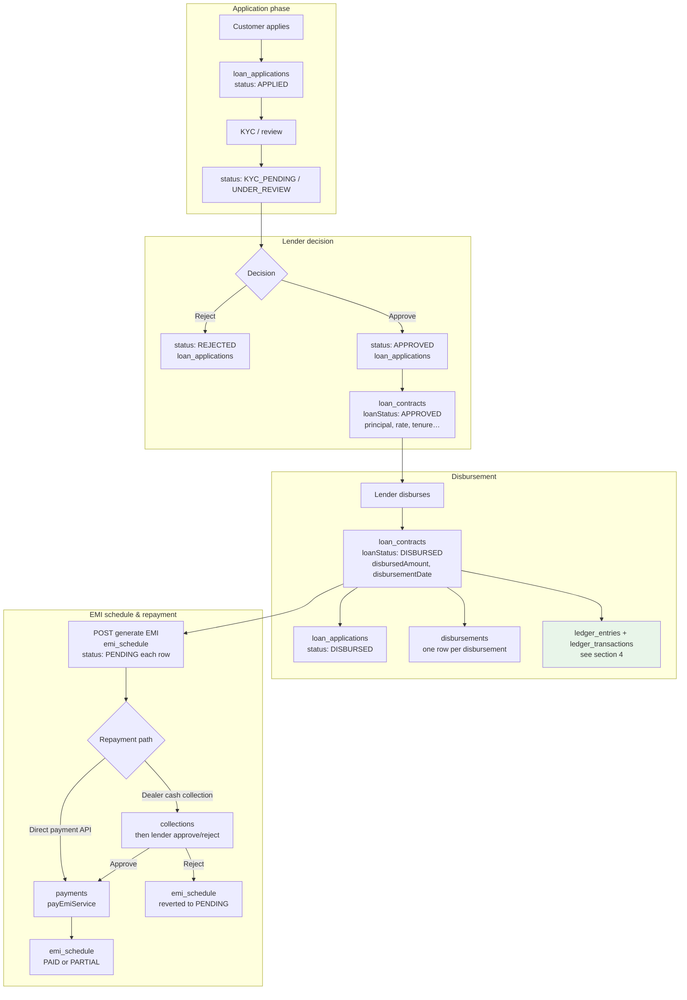
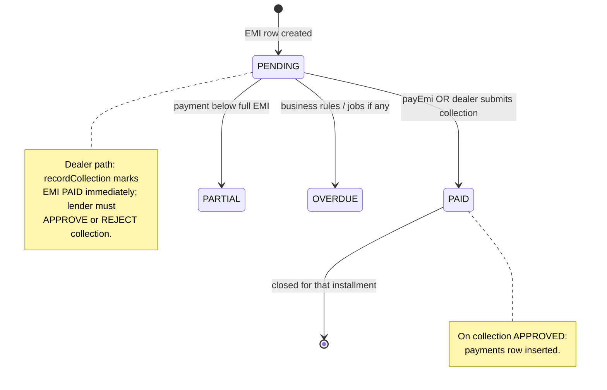
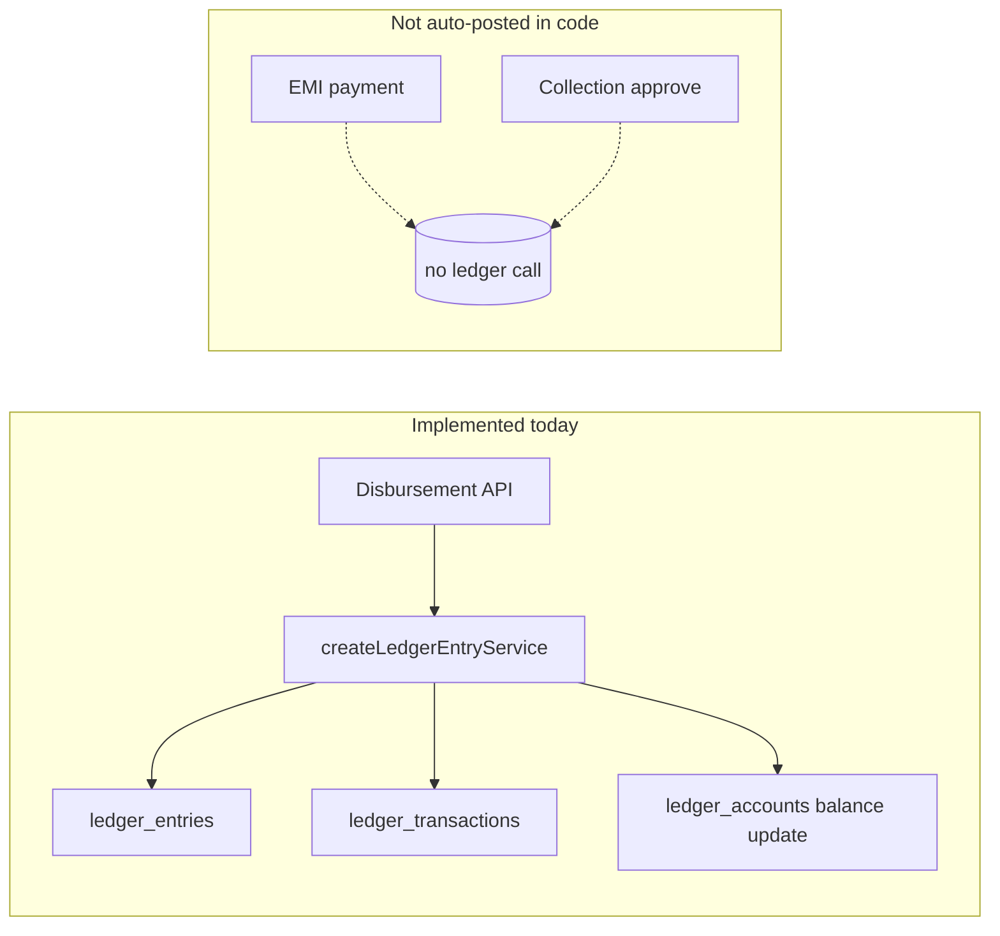

# Loan lifecycle: application → disbursement → EMI → ledger

This document describes the **loan journey** in this backend, **where data is stored in MongoDB**, and **how the ledger works** where it is implemented today.

---

## 1. End-to-end diagram (statuses & collections)

---

## 2. EMI paid vs unpaid (dealer collection flow)

**Code reference**

- **Direct EMI payment:** `payEmiService` in `src/modules/payments/payment.services.js` — creates `payments`, updates `emi_schedule` (`PAID` / `PARTIAL`). **No ledger posting.**
- **Dealer cash:** `recordCollectionService` — creates `collections`, sets EMI to `PAID`. `approveCollectionService` — sets collection `APPROVED`, inserts `payments`. **No ledger posting.** `rejectCollectionService` — reverts EMI to `PENDING`.

---

## 3. Ledger in this codebase (what is actually posted)

**Important:** The only place that calls `createLedgerEntryService` in the loan flow is **`disburseLoanService`** (`src/modules/loans/disbursement.services.js`).  
EMI payments and collection approval **do not** create `ledger_entries` / `ledger_transactions` today. You can still **manually** post entries via `POST /api/ledger/entries` (admin/authenticated use of `createLedgerEntryController`).

---

## 4. Disbursement ledger entry — when, why, debit/credit, balances

### When

- Immediately after a successful **disbursement** when the loan application is `APPROVED`, the contract is `APPROVED`, and the API records `disbursedAmount` and moves contract + application to disbursed state.

### Why (business meaning)

- **Customer loan account (asset from lender’s books):** the borrower **owes** the lender principal. Recording a **debit** to the customer loan account **increases** the receivable (money lent out = asset).
- **Lender settlement account (liability/settlement bucket in code):** crediting settlement represents **cash or funding leaving** the lender’s settlement side to the customer — modeled here as the balancing leg so debits = credits.

This is a simplified double entry: **loan principal recognized as receivable** vs **settlement outflow**.

### Exact lines (one journal entry, two legs)

| Leg | Account type | Direction | Amount | Effect on `ledger_accounts.balance` |
|-----|----------------|-----------|--------|--------------------------------------|
| 1 | `CUSTOMER_LOAN_ACCOUNT` | **DEBIT** | `disbursedAmount` | **Increases** balance |
| 2 | `LENDER_SETTLEMENT_ACCOUNT` | **CREDIT** | `disbursedAmount` | **Increases** balance |

### Why balances move that way (implementation)

Balance rules live in `updateLedgerAccountBalance` (`src/modules/ledger/ledgerAccount.repositories.js`):

- **Asset-style accounts** (includes `CUSTOMER_LOAN_ACCOUNT`):  
  - Debit → balance **+amount**  
  - Credit → balance **−amount**
- **Liability / income-style accounts** (includes `LENDER_SETTLEMENT_ACCOUNT`):  
  - Debit → balance **−amount**  
  - Credit → balance **+amount**

So for disbursement:

- Customer loan (asset): **DEBIT** → receivable **goes up** (customer owes more).
- Lender settlement (liability bucket): **CREDIT** → that account’s balance **goes up** on the liability side (implementation stores a signed `balance`; interpret with account type).

**Reference:** `disbursement.services.js` builds `transactions` with `LEDGER_TRANSACTION_TYPES.DEBIT` on the customer loan account and `CREDIT` on the lender settlement account.

### Row written to the database

1. **`ledger_entries`** — one document: `referenceType: "loan"`, `referenceId` = loan application id, `description` mentions disbursement.
2. **`ledger_transactions`** — two documents: each links `entryId`, `accountId`, `type` (`DEBIT` / `CREDIT`), `amount`.
3. **`ledger_accounts`** — each of the two accounts gets `$inc` on `balance` per the rules above.

Accounts are **auto-created** on first disbursement if missing: `CUSTOMER_LOAN_ACCOUNT` per customer, `LENDER_SETTLEMENT_ACCOUNT` per lender.

---

## 5. Where to see changes in the database (by action)

Use your MongoDB client (Compass, `mongosh`, etc.) on the app database (`MONGO_DB_NAME`).

| Action | Collections to inspect | What to look for |
|--------|--------------------------|------------------|
| Customer applies | `loan_applications` | New doc, `status` often `APPLIED` / `KYC_PENDING` / `UNDER_REVIEW` |
| Lender approves | `loan_applications`, `loan_contracts` | App `APPROVED`; new contract with `principalAmount`, `interestRate`, `tenureMonths`, `rateType`, `loanStatus: APPROVED` |
| Lender rejects | `loan_applications` | `REJECTED` |
| Disburse | `loan_applications`, `loan_contracts`, `disbursements`, **`ledger_entries`**, **`ledger_transactions`**, **`ledger_accounts`** | Contract + app `DISBURSED`; `disbursements` row; **new ledger entry + 2 transactions**; **two account balances updated** |
| Generate EMI schedule | `emi_schedule` | Many rows: `emiNumber`, `dueDate`, `emiAmount`, `principalComponent`, `interestComponent`, `status: PENDING` |
| Pay EMI (API) | `payments`, `emi_schedule` | New payment `SUCCESS`; EMI `PAID` or `PARTIAL` |
| Dealer records cash collection | `collections`, `emi_schedule` | Collection `PENDING_LENDER_CONFIRMATION`; EMI already `PAID` |
| Lender approves collection | `collections`, `payments` | Collection `APPROVED`; new `payments` with `transactionId` like `CASH_<collectionId>` |
| Lender rejects collection | `collections`, `emi_schedule` | Collection `REJECTED`; EMI back to `PENDING`, `paidAmount`/`paidAt` cleared |
| Prepayment (if used) | `emi_schedule`, `loan_contracts`, `prepayments`, `payments` | Pending EMIs replaced; principal updated |

**APIs to read ledger from the app**

- `GET /api/ledger/entries/loan/:loanId` — entries for that loan (`referenceId` is loan id for disbursement).
- `GET /api/ledger/accounts` — list accounts and balances.
- `GET /api/ledger/entries/:entryId` — one entry (with transactions as implemented in your list/detail handlers).

---

## 6. Account types reserved for future / manual entries

Defined in `LEDGER_ACCOUNT_TYPES` (`src/utils/constants.js`): e.g. `INTEREST_INCOME_ACCOUNT`, `PRINCIPAL_RECEIVABLE_ACCOUNT`, `CASH_COLLECTION_ACCOUNT`, `PAYMENT_GATEWAY_ACCOUNT`, `DEALER_COMMISSION_ACCOUNT`.  
They follow the same **asset vs liability/income** balance rules in `updateLedgerAccountBalance`.  
**Typical future EMI posting (not implemented):** debit cash/gateway, credit customer loan (principal), credit interest income — would require explicit `createLedgerEntryService` calls from payment/collection flows.

---

## 7. Quick reference — application statuses

From `LOAN_APPLICATION_STATUS`: `APPLIED`, `KYC_PENDING`, `UNDER_REVIEW`, `APPROVED`, `REJECTED`, `DISBURSED`, `CLOSED`, `DEFAULTED`.

Contract `loanStatus` from `LOAN_CONTRACT_STATUS`: e.g. `APPROVED` → `DISBURSED` → can become `ACTIVE` / others depending on other modules.

---

*Generated from the current `loan_app` backend implementation. If you add ledger posting to EMI or collections, update section 3–4 to list those journal entries and triggers.*
